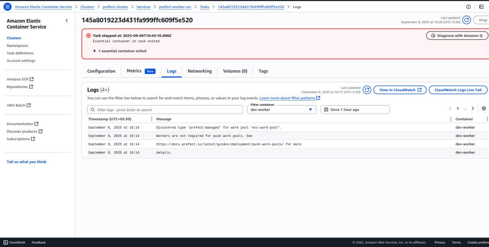

# Prefect Worker on ECS 

## 📌 Overview
This project was part of an assignment to deploy a Prefect worker on AWS ECS (Fargate) using Terraform.
The goal was to create all the required infrastructure, configure secrets, and connect a worker to Prefect Cloud.

NOTE: On the free Prefect Cloud plan,ECS workers(pull pools) are not supported.Only managed push pools can be used.SO,while the worker cannot stay alive on the free tier,the rest of the setup (networking,ECS cluster,roles,secrets etc)has been fully implemented.

## Infrastructure Setup

### VPC
- Public and private subnets across **3 Availability Zones**
- **Internet Gateway** for public subnet access
- **NAT Gateway** for outbound access from private subnets
- Proper **route tables** configured for traffic flow

### ECS Cluster3
- Cluster name: **`prefect-cluster`**

### Service Discovery
- Private namespace: **`prefect.local`**

### IAM Roles
- **Task execution role** with:
  - ECS permissions
  - Secrets Manager permissions

### Secrets Manager
- Stores **`PREFECT_API_KEY`**
- ECS task fetches secret dynamically at runtime

### ECS Task Definition
- Image: **`prefecthq/prefect:2-latest`**
- Environment variables:
  - `PREFECT_API_URL`
  - `PREFECT_API_KEY`

### ECS Service
- Launch type: **Fargate**
- Runs in **private subnets**
- Outbound-only access via **NAT Gateway**

### Cloudwatch logs
- Configured cloudwatch for accessing logs.

## Configuration
### Variables
1. Create an AWS account.
2. Create a prefect account on prefect cloud and store the api key in AWS Secret manager as " prefect_api_key".
3. create a terraform.tfvars file and include the following credentials in it
```
aws_region          = "us-east-1"
prefect_account_id  = "<your-account-id>"
prefect_workspace_id = "<your-workspace-id>"
```
4. configure AWS CLI in your terminal
 ```
 aws configure
 ```
  It will ask
 ```
  AWS Access Key ID [None]: <your-access-key-id>
  AWS Secret Access Key [None]: <your-secret-access-key>
  Default region name [None]: us-east-1
  Default output format [None]: json
  ```
4.Create a work pool named ecs-work-pool manually on prefect cloud.
## Deployment
 1. Clone the repo
   ```
   git clone https://github.com/shaluchan/AI-PLANET-Assignment.git
   cd AI-PLANET ASSIGNMENT
   ```
 2. Initialize terraform
   ```
   terraform init
   ```
 3. Review the plan
   ```
   terraform plan
   ```
 4. Apply changes
   ```
   terraform apply
   ```

## Verification

- ECS cluster and service should be visible in AWS console.

- Task definition prefect-worker deployed with container.

- Secret prefect_api_key fetched by ECS at runtime.

- Logs show connection attempts to Prefect Cloud.

  ```
    Workers are not required for push work pools.
  ```


## Clean-Up
  ```
  terraform destroy
  ```


